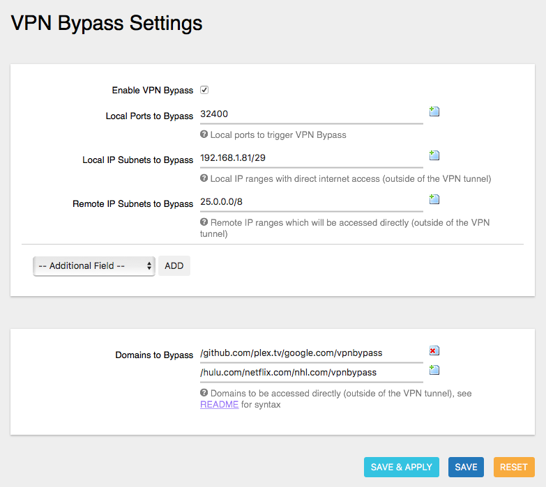

# VPN Bypass
A simple PROCD-based vpnbypass service for OpenWrt/LEDE Project. Useful if your router accesses internet thru VPN client/tunnel, but you want specific traffic (ports, IP ranges, domains or local IP ranges) to be routed outside of this tunnel.

## Features
- Allows to define local ports so that traffic to them is routed outside of the VPN tunnel (by default routes Plex Media Server traffic (port 32400) outside of the VPN tunnel).
- Allows to define IPs/subnets in local network so that their traffic is routed outside of the VPN tunnel (by default routes traffic from 192.168.1.81-192.168.1.87 outside of the VPN tunnel).
- Allows to define remote IPs/ranges that they are accessed outside of the VPN tunnel (by default routes LogmeIn Hamachi traffic (25.0.0.0/8) outside of the VPN tunnel).
- Allows to define list of domain names which are accessed outside of the VPN tunnel (useful for Netflix, Hulu, etc).
- Doesn't stay in memory -- creates the iptables rules which are automatically updated on WAN up/down.
- Has a companion package (luci-app-vpnbypass) so everything can be configured with Web UI.
- Proudly made in Canada, using locally-sourced electrons.

## Screenshot (luci-app-vpnbypass)


## Requirements
This service requires following packages to be installed on your router: ```ip-full ipset iptables dnsmasq-full``` (```ip-full``` requires you uninstall ```ip``` first; ```dnsmasq-full``` requires you uninstall ```dnsmasq``` first). Run the following commands to satisfy the requirements:
```sh
opkg update
opkg remove dnsmasq ip
opkg install ip-full ipset iptables dnsmasq-full
```

## How to install
```sh
opkg update
opkg install vpnbypass luci-app-vpnbypass
```
Default install routes Plex Media Server traffic (port 32400) outside of the VPN tunnel, routes LogmeIn Hamachi traffic (25.0.0.0/8) outside of the VPN tunnel and also routes internet traffic from local IPs 192.168.1.81-192.168.1.87 outside of the VPN tunnel. You can safely delete these example rules if they do not apply to you.

## Documentation / Discussion
Please head to [LEDE Project Forum](https://forum.lede-project.org/t/vpn-bypass-split-tunneling-service-luci-ui/1106) for discussions of this service.

### Bypass Domains Format/Syntax
Domain lists should be in following format/syntax: ```/domain1.com/domain2.com/vpnbypass```. Please don't forget the leading ```/``` and trailing ```/vpnbypass```. There's no validation if you enter something incorrectly -- it just won't work. Please see [Notes/Known Issues](#notesknown-issues) if you want to edit this setting manually, without Web UI.

## What's New
1.1.1
- More reliable way of obtaining WAN gateway on boot (thanks @dibdot for the hint!).

1.1.0:
- Detects individual IP addresses in the config and converts them to subnet automatically.
- Proper implementation of reload on vpnbypass config change.

1.0.0:
- Hotplug script created during install.

0.1.0:
- Package built.
- Support for user-defined ports implemented.
- Support for user-defined routes implemented.
- Support for user-defined local ranges implemented.

0.0.1:
- Initial release.

## Notes/Known Issues
Domains to be accessed outside of VPN tunnel are not defined in ```/etc/config/vpnpass```, but rather in ```/etc/config/dhcp```. To add/delete/edit domains you can use VPN Bypass Web UI or you can edit ```/etc/config/dhcp``` manually or run following commands:
```sh
uci add_list dhcp.@dnsmasq[-1].ipset='/github.com/plex.tv/google.com/vpnbypass'
uci add_list dhcp.@dnsmasq[-1].ipset='/hulu.com/netflix.com/nhl.com/vpnbypass'
uci commit dhcp
/etc/init.d/dnsmasq restart
```
